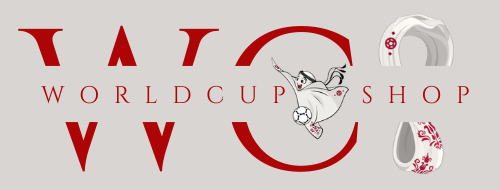

<!-- PROJECT LOGO -->
<br />
<div align="center">
  <a href="https://github.com/B3INGLOG2022/WorldCupShop">
    
  </a>

  <h3 align="center">WORLDCUPSHOP</h3>

  <p align="center">
    Bienvenue sur notre projet de e-commerce WorldCupSop.
    <br />
    <a href="">View Demo</a>
  </p>
</div>

<!-- TABLE OF CONTENTS -->
<details>
  <summary>Table of Contents</summary>
  <ol>
    <li>
      <a href="#getting-started">Bien débuter le projet</a>
      <ul>
        <li><a href="#prerequisites">Prérequis</a></li>
        <li><a href="#installation">Installation</a>
         <ul>
            <li><a href="#back">Back-end</a></li>
            <li><a href="#front">Front-end</a></li>
        </ul>
        </li>
      </ul>
    </li>
    <li><a href="#tools">Outils & Pachages utilisés</a></li>
    <li><a href="#contact">Contact</a></li>
  </ol>
</details>

<!-- GETTING STARTED -->
<div id='getting-started'/>
## Bien débuter le projet

Dans le but de pouvoir pleinement profiter de la démo de notre WPA, une liste de prérequis seront à respecter.

<div id='prerequisites'/>
### Prérequis

Dans un premier temps il faudra vous assurer que vous ayez sur votre poste :

* une version récente de npm
  ```sh
  npm install npm@latest -g
  ou
  https://www.npmjs.com/
  ```
* le logiciel xampp
  ```
  https://www.apachefriends.org/fr/index.html
  ```
* le logiciel git
  ```
  https://git-scm.com/
  ```

<div id='installation'/>
### Installation

_Une fois les prérequis respectés, vous pourrez commencer à suivre les étapes d'installations du projet ci-dessous._

<div id='back'/>
#### Back

1. Placez vous dans le repertoire de votre choix et faites un clone du repo :
   ```sh
   git clone https://github.com/MAILLERC0/worldcupshop_back
   ```
2. Ouvrez le repo qui a été cloné dans une invite de commande et installez les packages npm :
   ```sh
   npm install
   ```
3. Démarrez le logiciel XAMMPP et démarrez les modules Apache & MySQL
4. Administrez votre serveur phpMyAdmin en sélectionnant le bouton admin du module MySQL
5. Créez vous une nouvelle base de données "directus"
6. Allez dans l'onglet Importer et selectionnez le fichier directus.SQL présent dans le repertoire bdd du repo cloné précedement.
7. Ouvrez une nouvelle invite de commande dans le repo worldcupshop_back et démarrez directus :
   ```sh
   npx directus start
   ```
8. il vous est possible de démarrer l'interface directus :
    ```
   http://localhost:8055/
   ```
9. Connectez vous avec les credentials :
    ```
    login : "admin@exxample.com"
    password : "password"
   ```

<div id='front'/>
#### Front
1. Placez vous dans le repertoire de votre choix et faites un clone des repos :
   ```sh
   git clone https://github.com/B3INGLOG2022/WorldCupShop
   ```
2. Installez les packages npm :
   ```sh
   npm install
   ```
3. Démarrez votre front avec la commande :
    ```sh
   npm run start
   ```
4. Visualisez la démo sur :
   ```
   http://localhost:3000/
   ```
<!-- CONTACT -->
<div id='tools'/>
## Outils & Pachages utilisés

Ce Projet nous aura permis d'utiliser un certain nombre de packages / outils de developpement avec notamment :
    - reactjs 💻
    - directus 💻
    - commercejs 💻
    - emailjs 📖
    - mui 📖
    - react-router-dom 📦
    - toastify 📦
    - react-cookie 📦
    - axios 📦
    - reduxjs 📦

<div id='contact'/>
## Contact

[Corentin Mailler](https://www.linkedin.com/in/corentin-mailler/) - corentin.mailler@ynovcom
[Matthieu Bouillot](https://www.linkedin.com/in/matthieu-bouillot/) - matthieu.bouillot@ynovcom

Lien du projet: [https://github.com/B3INGLOG2022/WorldCupShop](https://github.com/B3INGLOG2022/WorldCupShop)
